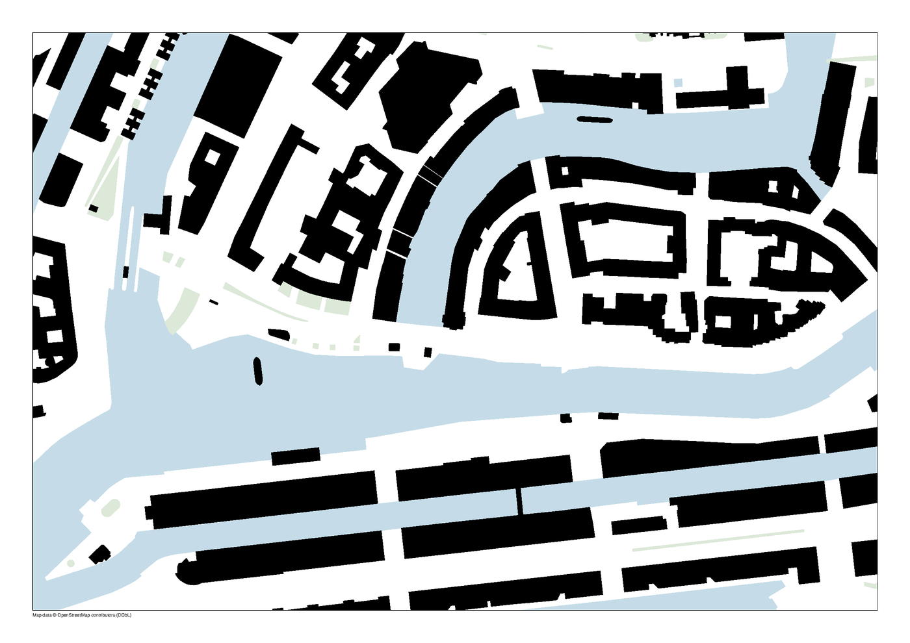

# Schwarzplan Generator

Generate exact-scale architectural figure-ground diagrams from OpenStreetMap
data. Pick a location, choose a scale and paper size, and export a print-ready
PDF, an editable SVG, or a CAD-ready DXF.



## What it does

- **Four layers** — buildings (Schwarzplan), water (Blauplan), parks and
  greenery (Grünplan), and roads (Strassennetz). Each has its own colour.
- **Exact scale** — 1:200 through 1:25000 on A4 to A0 and square formats. A
  100 m distance measures 100 mm on paper at 1:1000.
- **Real courtyards** — inner rings are cut out of building footprints rather
  than filled in.
- **Three formats** — vector PDF for print, layered SVG for Illustrator or
  Figma, DXF with named layers for CAD.

## Installing

Download the build for your platform from the
[latest release](https://github.com/jaenixm/Schwarzplan/releases/latest).

### macOS

Unzip, move `Schwarzplan.app` to Applications, then run:

```bash
xattr -dr com.apple.quarantine /Applications/Schwarzplan.app
```

The app is not signed with an Apple Developer certificate, so macOS quarantines
it on download. Without that command you will see "Schwarzplan is damaged and
can't be opened" — the app is fine, macOS is refusing to run an unsigned
download.

### Windows

Unzip and run `Schwarzplan.exe`. SmartScreen will warn about an unrecognised
publisher: choose **More info**, then **Run anyway**.

## Running from source

```bash
pip install -r requirements.txt
python src/main.py
```

`generate_schwarzplan.py` renders a Hamburg sample when run directly, and works
as a library for anything else:

```python
from generate_schwarzplan import create_schwarzplan_a3_landscape, create_schwarzplan_by_bbox

create_schwarzplan_a3_landscape(
    (53.558148, 9.963214),
    scale=1000,
    include_water=True,
    output_filename="hamburg.pdf",
)

# Or give a bounding box and let it pick a scale that fits the sheet:
create_schwarzplan_by_bbox(
    (53.5620, 53.5540, 9.9720, 9.9560),  # north, south, east, west
    output_filename="altstadt.pdf",
)
```

## Limits

- One request covers at most about 6 km across. Larger areas are refused before
  the request is sent, because the OpenStreetMap servers will not answer them.
  For a bigger area, use a larger scale number or a smaller sheet.
- Downloaded geometry is cached for two weeks. Clear the cache to force a
  refetch:
  - macOS: `~/Library/Caches/Schwarzplan`
  - Windows: `%LOCALAPPDATA%\Schwarzplan\Cache`
  - Linux: `~/.cache/schwarzplan`
- Coverage depends on what OpenStreetMap has. Building data is excellent across
  most of Europe and patchy elsewhere.

## Development

```bash
pip install -r requirements-dev.txt
python -m pytest
```

Flet changes its API between minor releases, so both Flet packages are pinned
exactly. Upgrading them means checking the app still starts.

Building desktop apps locally:

```bash
flet build macos --yes
flet build windows --yes
```

CI builds both on every push to `main`. Pushing a `v*` tag additionally
publishes a GitHub Release with installation instructions attached.

## Attribution and licensing

Map data is © OpenStreetMap contributors and available under the
[Open Database License](https://www.openstreetmap.org/copyright). Every plan
this app exports carries that attribution, and you must keep it on anything you
publish. Basemap tiles in the app preview are © [CARTO](https://carto.com/attributions).

The app itself is MIT licensed — see [LICENSE](LICENSE).
